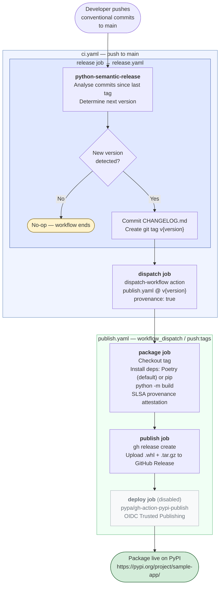

# Python Reusable CI/CD

Reuseable workflows and actions to release a Python app using semantic versioning, create a wheel package artifact, and
publish a release.

- **setuptools + setuptools-scm** for portable, backend-agnostic building with dynamic git-tag versioning
- **Poetry** (optional) for dependency management; used in this project
- **Poe the Poet** (`poe`) (optional) for task running; used in this project
- **python-semantic-release** for automated versioning and GitHub Releases
- **PyPI** (optional) publishing via OIDC Trusted Publishers (no stored API tokens)

## Project layout

```none
.
├── src/
├── .github/
│   ├── workflows/
│   │   ├── release.yaml        # semantic release — push to main
│   │   ├── publish.yaml        # build + publish — triggered via workflow_dispatch from ci.yaml
│   │   ├── test.yaml           # run tests — reusable; called by ci.yaml
│   │   └── pre-commit.yaml     # pre-commit checks — pull_request
│   │   └── ci.yaml             # main end-to-end workflow
│   └── sample_app/
│       ├── __init__.py
│       └── cli.py              # entry point: `sample-app`
├── tests/
│   └── test_cli.py
├── pyproject.toml              # project + build + Poetry + poe + style config
└── releaserc.toml              # python-semantic-release config
```

> [!NOTE]
> The sample app in this project exists purely for demo and testing purposes.

## Prerequisites

- Python ≥ 3.10
- [Poetry](https://python-poetry.org/docs/#installation) ≥ 2.0

## Getting started

```bash
# Install all dependencies (dev + test)
poe install

# Run the app
poetry run sample-app

# Run tests
poe test

# Format code
poe fmt
```

## How versioning works

Version numbers live **only in git tags** — no version is stored in any source file.

[python-semantic-release](https://python-semantic-release.readthedocs.io/) (PSR) analyzes commit messages and creates a
tag (e.g. `v1.2.3`). [setuptools-scm](https://setuptools-scm.readthedocs.io/) reads that tag at build time and stamps it
into the wheel metadata. Nothing else tracks a version number.



Commit messages drive the bump level:

| Prefix                        | Effect          |
| ----------------------------- | --------------- |
| `fix:`, `perf:`, `refactor:`  | patch — `0.0.x` |
| `feat:`                       | minor — `0.x.0` |
| `feat!:` / `BREAKING CHANGE:` | major — `x.0.0` |

Pre-release branches are also supported:

| Branch pattern      | Pre-release token | Example tag    |
| ------------------- | ----------------- | -------------- |
| `release/*`, `rc/*` | `rc`              | `v1.2.0rc1`    |
| `beta/*`, `dev/*`   | `beta`            | `v1.2.0beta1`  |
| `test/*`            | `alpha`           | `v1.2.0alpha1` |

## Releasing

Releases are triggered automatically on every push to `main`. No manual steps are required beyond merging.

The `ci.yaml` workflow calls `release.yaml` (PSR), then dispatches `publish.yaml` via the GitHub API using the `gh` CLI
(pre-installed on all GitHub-hosted runners):

```bash
# Equivalent manual dispatch via gh CLI:
gh workflow run publish.yaml --ref v1.2.3 --field tag=v1.2.3

# Or via curl:
curl -X POST \
  -H "Authorization: Bearer $GITHUB_TOKEN" \
  -H "Accept: application/vnd.github+json" \
  https://api.github.com/repos/{owner}/{repo}/actions/workflows/publish.yaml/dispatches \
  -d '{"ref":"v1.2.3","inputs":{"tag":"v1.2.3"}}'
```

### One-time PyPI setup (Optional)

To enable the `deploy` job in `publish.yaml`, add a Trusted Publisher on PyPI (no API tokens needed):

1. Go to <https://pypi.org/manage/account/publishing/>
2. Add a new publisher:
   - **PyPI project name**: `sample-app`
   - **Owner**: your GitHub org or username
   - **Repository**: your repo name
   - **Workflow filename**: `publish.yaml`
   - **Environment name**: `pypi`

Then uncomment the `deploy` job in [.github/workflows/publish.yaml](.github/workflows/publish.yaml).

### Local dry-run

```bash
export GITHUB_TOKEN=<your-pat>

# Preview what the next version would be
poe next

# Preview with a specific bump
poe semver minor

# Preview a pre-release
poe semver patch --pre
```

### Implementation example

```yaml
on:
  push:
    branches: [main]

permissions:
  contents: read

jobs:
  release:
    uses: {owner}/python-reusable-workflows/.github/workflows/release.yaml@{ref}
    permissions:
      contents: write
    with:
      config-file: releaserc.toml
    secrets: inherit

  dispatch:
    runs-on: ubuntu-latest
    needs: release
    if: needs.release.outputs.released == 'true'
    permissions:
      actions: write    # required to trigger workflow_dispatch
    steps:
      - name: Action | Dispatch publish workflow
        uses: {owner}/python-reusable-workflows/.github/actions/dispatch-workflow@{ref}
        with:
          workflow: publish.yaml
          tag: ${{ needs.release.outputs.tag }}
          provenance: true
```

> [!NOTE]
> **Why not rely on `publish.yaml`'s `on: push: tags:` trigger?**
>
> GitHub blocks `GITHUB_TOKEN`-authored pushes from firing further `push`/`create` events — a safeguard
> against loops. Since PSR creates its tag using `GITHUB_TOKEN`, the tag push is invisible to `push: tags`
> listeners. `workflow_dispatch` is the explicit exception: `GITHUB_TOKEN` *is* allowed to trigger it.
> ([GitHub docs: Triggering a workflow from a workflow](https://docs.github.com/en/actions/writing-workflows/choosing-when-your-workflow-runs/triggering-a-workflow#triggering-a-workflow-from-a-workflow))

`secrets: inherit` passes the caller's `GITHUB_TOKEN` (and any other repo secrets) into each reusable workflow.

Add a `releaserc.toml` to your repo to customise PSR options (commit parser, branch patterns, changelog). If absent, PSR
uses its built-in defaults.

### What callers get for free

- Pinned action versions (`python-semantic-release`, `setup-python`, etc.) managed in one place
- The full build pattern: Poetry install → `python -m build` → setuptools-scm version stamping
- Optional post-release dispatch to `publish.yaml` via a `dispatch` job in the caller workflow
- Matrix test runs across one or more Python versions via `test.yaml`

`poe` tasks are a **local development** convenience and are not used in CI. Callers do not need `poethepoet` or any poe
tasks to use these reusable workflows.

### What callers must supply

| Item                                            | Required       | Notes                                                                                                                                                         |
| ----------------------------------------------- | -------------- | ------------------------------------------------------------------------------------------------------------------------------------------------------------- |
| `pyproject.toml` with `[build-system]`          | Yes            | `python -m build` needs a build backend declared for the caller's project                                                                                     |
| `releaserc.toml`                                | No             | If absent, PSR uses its built-in defaults. Add your own to override commit parser options, branch patterns, or changelog settings.                            |
| `poetry.lock`                                   | No             | Used when present (if Poetry is enabled) for reproducible installs. If absent, `poetry lock` generates it at build time. Not used when `requirements` is set. |
| `.github/workflows/publish.yaml` (thin wrapper) | No — see below | Only needed for manual `workflow_dispatch` triggers; the `release` → `publish` chain is handled via `needs:` outputs in the calling workflow                  |

## Reusable workflows reference

The `release.yaml`, `publish.yaml`, `test.yaml`, and `pre-commit.yaml` all support `workflow_call`.

### `release.yaml`

Runs python-semantic-release, commits the changelog, creates the git tag, and (optionally) a GitHub Release.

**Triggers**

| Trigger             | Details                                                                                                          |
| ------------------- | ---------------------------------------------------------------------------------------------------------------- |
| `workflow_call`     | Called from a parent workflow via `uses:`; exposes `released` and `tag` outputs                                  |
| `workflow_dispatch` | Manual trigger from the Actions UI; accepts `force-bump` (auto / patch / minor / major) and `config-file` inputs |

**Outputs**

| Output     | Description                                                                 |
| ---------- | --------------------------------------------------------------------------- |
| `released` | `'true'` if a new version was released, `'false'` otherwise                 |
| `tag`      | The released tag (e.g. `v1.2.3`); empty string when `released` is `'false'` |

**Inputs**

| Input         | Type   | Default | Description                                                                                                                                                                                                        |
| ------------- | ------ | ------- | ------------------------------------------------------------------------------------------------------------------------------------------------------------------------------------------------------------------ |
| `config-file` | string | `""`    | Path to the PSR config file relative to the repo root (e.g. `releaserc.toml` or `pyproject.toml`). If empty, PSR uses its built-in defaults and will **not** read `[tool.semantic_release]` from `pyproject.toml`. |

**Required permissions**

| Permission        | Reason                                |
| ----------------- | ------------------------------------- |
| `contents: write` | Push changelog commit, create git tag |

**Usage example**

```yaml
jobs:
  release:
    uses: {owner}/python-reusable-workflows/.github/workflows/release.yaml@{ref}
    permissions:
      contents: write
    with:
      config-file: releaserc.toml
    secrets: inherit
```

---

### `publish.yaml`

Checks out the tag, builds the wheel and sdist, generates a SLSA provenance attestation, and uploads the artifacts to a
GitHub Release.

**Triggers**

| Trigger             | Details                                                                                                                                   |
| ------------------- | ----------------------------------------------------------------------------------------------------------------------------------------- |
| `push: tags: v*`    | Fires when a `v*` tag is pushed with personal credentials; tags created by `GITHUB_TOKEN` (e.g. by PSR) do **not** trigger this           |
| `workflow_call`     | Called from a parent workflow via `uses:`                                                                                                 |
| `workflow_dispatch` | Manual trigger from the Actions UI; accepts `tag`, `python-version`, `poetry-version`, `requirements`, `poetry-as-fallback`, `provenance` |

**Inputs**

| Input                | Type    | Default    | Required | Description                                                                                                                                                                         |
| -------------------- | ------- | ---------- | -------- | ----------------------------------------------------------------------------------------------------------------------------------------------------------------------------------- |
| `tag`                | string  |            | Yes      | Release tag to build and publish (e.g. `v1.2.3`).                                                                                                                                   |
| `python-version`     | string  | `"3.12"`   | No       | Python version to use for building.                                                                                                                                                 |
| `poetry-version`     | string  | `"latest"` | No       | Poetry version to install. Pin to a specific version (e.g. `"1.8.5"`) for reproducibility.                                                                                          |
| `requirements`       | string  | `""`       | No       | Path to a requirements file or pip package specifiers. Leave empty to use Poetry.                                                                                                   |
| `poetry-as-fallback` | boolean | `true`     | No       | Use Poetry when `requirements` is empty. Set to `false` to skip all dependency installation and go straight to `python -m build`.                                                   |
| `provenance`         | boolean | `false`    | No       | Generate a SLSA build provenance attestation. Requires a GitHub-hosted runner (or self-hosted with OIDC). On `push: tags` triggers, the `PROVENANCE` env var controls this instead. |

**Dependency installation paths**

| Condition                                                 | Path                                                |
| --------------------------------------------------------- | --------------------------------------------------- |
| `requirements` empty, `poetry-as-fallback` true (default) | Poetry: `poetry lock && poetry install`             |
| `requirements` set to a regular file                      | pip: `pip install -r <file>`                        |
| `requirements` set to anything else                       | pip: `pip install <value>` (package specifiers)     |
| `requirements` empty, `poetry-as-fallback` false          | No deps installed — `python -m build` runs directly |

**Required permissions**

| Permission            | Reason                                                                 |
| --------------------- | ---------------------------------------------------------------------- |
| `contents: write`     | Upload artifacts to GitHub Release                                     |
| `id-token: write`     | OIDC token for provenance signing (only when `provenance` is enabled)  |
| `attestations: write` | Persist the provenance attestation (only when `provenance` is enabled) |

**Usage example**

```yaml
jobs:
  publish:
    uses: {owner}/python-reusable-workflows/.github/workflows/publish.yaml@{ref}
    permissions:
      contents: write
      id-token: write       # only if provenance: true
      attestations: write   # only if provenance: true
    with:
      tag: ${{ needs.release.outputs.tag }}
      # python-version: "3.12"
      # poetry-version: "latest"
      # requirements: ""
      # provenance: true
    secrets: inherit
```

---

### `test.yaml`

Runs pytest. Supports a single Python version or a matrix across multiple versions.

**Triggers**

| Trigger         | Details                                   |
| --------------- | ----------------------------------------- |
| `pull_request`  | Runs on pull requests targeting `main`    |
| `workflow_call` | Called from a parent workflow via `uses:` |

**Inputs**

| Input            | Type   | Default  | Required | Description                                                                                                                |
| ---------------- | ------ | -------- | -------- | -------------------------------------------------------------------------------------------------------------------------- |
| `python-version` | string | `"3.12"` | No       | Python version(s) to test against. Comma-separated for a matrix run (e.g. `"3.10, 3.11, 3.12"`).                           |
| `requirements`   | string | `""`     | No       | Path to a requirements file to install before running tests. Leave empty to install from `pyproject.toml` `[test]` extras. |

**Required permissions**

| Permission       | Reason   |
| ---------------- | -------- |
| `contents: read` | Checkout |

**Usage example**

```yaml
jobs:
  test:
    uses: {owner}/python-reusable-workflows/.github/workflows/test.yaml@{ref}
    permissions:
      contents: read
    with:
      # python-version: "3.12"             # default; single version
      # python-version: "3.10, 3.11, 3.12" # comma-separated for matrix run
      # requirements: ""                   # leave empty to install from pyproject.toml [test] extras
    secrets: inherit
```

---

### `pre-commit.yaml`

Runs [pre-commit](https://pre-commit.com/) hooks against all files.

**Triggers**

| Trigger             | Details                                                                |
| ------------------- | ---------------------------------------------------------------------- |
| `push`              | Runs on every push to any branch                                       |
| `workflow_call`     | Called from a parent workflow via `uses:`                              |
| `workflow_dispatch` | Manual trigger from the Actions UI; accepts an optional `config` input |

**Inputs**

| Input    | Type   | Default                     | Required | Description                         |
| -------- | ------ | --------------------------- | -------- | ----------------------------------- |
| `config` | string | `".pre-commit-config.yaml"` | No       | Path to the pre-commit config file. |

**Required permissions**

| Permission            | Reason                                |
| --------------------- | ------------------------------------- |
| `contents: read`      | Checkout                              |
| `pull-requests: read` | Read PR metadata for pre-commit hooks |

**Usage example**

```yaml
jobs:
  pre-commit:
    uses: {owner}/python-reusable-workflows/.github/workflows/pre-commit.yaml@{ref}
    permissions:
      contents: read
      pull-requests: read
    with:
      # config: .pre-commit-config.yaml    # default
    secrets: inherit
```

## Configuration

| File                                | Purpose                                                                                                       |
| ----------------------------------- | ------------------------------------------------------------------------------------------------------------- |
| `pyproject.toml`                    | Project metadata, setuptools/setuptools-scm, Poetry deps, poe tasks, style tools                              |
| `releaserc.toml`                    | python-semantic-release options (changelog, branches, token)                                                  |
| `.github/workflows/release.yaml`    | Semantic release — push to main; supports `workflow_call`                                                     |
| `.github/workflows/publish.yaml`    | Build + publish — supports `workflow_call`; uses Poetry when `requirements` is empty (default), pip otherwise |
| `.github/workflows/test.yaml`       | Run tests — supports `workflow_call`; matrix across one or more Python versions                               |
| `.github/workflows/pre-commit.yaml` | Pre-commit checks — runs on pull_request and push to main                                                     |
| `.github/workflows/ci.yaml`         | End-to-end integration test — chains `release.yaml` → `publish.yaml`; fires on `test/*` branches              |
